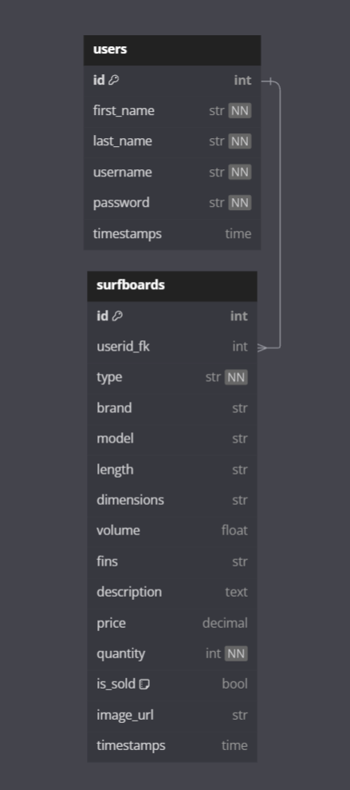

Welcome fellow kooks to SIMS, otherwise known as the Surfboard Inventory Management System.

Back end start up: You will need to create your own container and postgres database.  Your database can then be migrated/seeded with repository files via VSC and terminal commands.

Front end start up: Open the repository in VSC and start the with npm start.

Plesae login using the admin credentials:

    Username: bsullins
    Password: password

You can then navigate to the User Admin page and create your own account.

User Admin page can add, edit and delete users.

Surfboard Admin page can add, edit and delete surfboards.  Be sure to add your userid when you add a new surfboard so you can sort/filter your own boards.

Home Page is viewable to both logged in and logged out users as a view only of the surfboard inventory.

Entity Relationship Diagram

